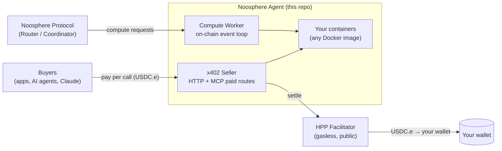

<div align="center">

# Noosphere Agent

**Run AI models. Get paid per call.**

Turn any Docker container into a paid API on the [HPP](https://hpp.io) network —
buyers pay in USDC.e over HTTP or MCP, you receive on-chain.
No smart contracts to write, no gas needed, no funds required to start.

[](./LICENSE)
[](https://nodejs.org)
[](https://docs.x402.org)

[Quick Start](#-quick-start) · [Sell a Model in 10 Minutes](#-sell-your-first-ai-model-in-10-minutes) ·
[How Payments Work](#-how-payments-work) · [Configuration](#-configuration-reference) ·
[Compute Network](#-earn-from-the-noosphere-compute-network)

</div>

---

## What is this?

Noosphere Agent is a node that **earns money by running compute**. It supports two
independent revenue rails — enable either or both:

| | 💰 **x402 Seller** | ⛓ **Compute Network Worker** |
|---|---|---|
| What | Sell *your own* models/containers per-call | Serve on-chain compute subscriptions |
| Buyers come from | HTTP, MCP (Claude Desktop, agents), [discovery](https://x402-discovery.hpp.io) | Noosphere protocol (Router/Coordinator) |
| Payment | USDC.e per call, settled instantly via [x402](https://docs.x402.org) | On-chain billing per interval |
| Verification | Optional signed [execution receipt](#execution-receipts) | On-chain verifier contracts |
| Setup cost | **Zero** — empty wallet works, gas is sponsored | Wallet needs ETH for delivery gas |
| Best for | Monetizing a model you already have | Joining the compute marketplace |



---

## 🚀 Quick Start

> Prerequisites: Node.js ≥ 18, Docker ≥ 20.10

```bash
# 1. Install
git clone https://github.com/hpp-io/noosphere-agent-js.git
cd noosphere-agent-js
npm install

# 2. Configure — pick containers from the registry, opt into selling
npm run generate:config           # interactive; answers "y" to selling = paid routes
cp .env.example .env              # then set KEYSTORE_PASSWORD

# 3. Create your wallet (keystore)
npm run init                      # prints your agent + receiving addresses

# 4. Run
npm run agent                     # agent API on :4000
npm run dev                       # web dashboard on :3100 (separate terminal)
```

That's it. If you enabled selling, your services are live at
`POST /paid/compute/<service>` and as MCP tools at `/mcp` — see
[what buyers do](#-how-buyers-pay-you).

> **Selling requires no funds.** Payments settle buyer → your wallet directly and
> the facilitator sponsors all gas. You only need ETH if you also join the
> [on-chain compute network](#-earn-from-the-noosphere-compute-network).

---

## 🤗 Sell Your First AI Model in 10 Minutes

The complete path from a free HuggingFace model to your first on-chain payment.
*(This exact scenario is exercised end-to-end in our test runs — fresh clone,
brand-new empty wallet, Docker — and finishes with real USDC.e arriving.)*

### 1. Wrap the model — one endpoint is the whole contract

```
POST /computation   { "input": "<raw>", ...buyer JSON }  →  { "output": "<string>" }
```

[`examples/hf-sentiment`](./examples/hf-sentiment) does this for
`distilbert-base-uncased-finetuned-sst-2-english` (free, no HF token) in ~30
lines of FastAPI:

```bash
cd examples/hf-sentiment
docker build -t hf-sentiment:latest .
```

Any model works the same way — swap the `pipeline(...)` call
(`text-generation`, `summarization`, translation, your own fine-tune…) and the
input/output mapping. See the [example README](./examples/hf-sentiment/README.md).

### 2. Register it in `config.json`

Start from [config.example.json](./config.example.json) (it carries the `chain`
block with the right network addresses), then add your container and service:

```jsonc
{
  "containers": [
    { "id": "hf-sentiment", "name": "hf-sentiment",
      "image": "hf-sentiment:latest", "port": "8090" }
  ],
  "x402Seller": {
    "enabled": true,
    "facilitators": { "eip155:181228": "https://facilitator-sepolia.hpp.io" },
    "defaultAsset": {
      "eip155:181228": {
        "address": "0x401eCb1D350407f13ba348573E5630B83638E30D",
        "extra": { "name": "Bridged USDC", "version": "2" }
      }
    },
    "services": [
      {
        "name": "sentiment",                 // → POST /paid/compute/sentiment
        "containerId": "hf-sentiment",
        "settlement": "direct",
        "network": "eip155:181228",
        "schemes": ["exact"],
        "x402Price": "5000",                 // atomic USDC.e → $0.005 per call
        "inputSchema": {                     // validated BEFORE payment
          "type": "object", "required": ["text"],
          "properties": { "text": { "type": "string" } }
        },
        "receipt": true,                     // verifiable execution receipt
        "description": "Sentiment analysis, per call"
      }
    ]
  }
}
```

### 3. Run and earn

```bash
npm run init && npm run agent
```

The agent pulls the image, starts the container, and serves the paid route.
When a buyer calls:

```jsonc
// POST /paid/compute/sentiment  {"text": "I love this product"}
{
  "jobId": "6b2c1e5e-…",
  "service": "sentiment",
  "output": "POSITIVE (0.9998)",
  "receipt": { "settlement": { "transaction": "0xb83a…" }, "…": "…" }
}
```

…and the USDC.e is already in your wallet — check the **x402 Seller** tab in the
dashboard, or `GET /api/seller/summary`.

---

## 💸 How Payments Work

Standard [x402](https://docs.x402.org) — HTTP 402 + signed payment, settled
on-chain by the public HPP facilitator:

```
buyer                         your agent                    facilitator
  │  POST /paid/compute/svc      │                              │
  │ ───────────────────────────▶ │  402 + payment requirements  │
  │ ◀─────────────────────────── │                              │
  │  retry + signed payment      │                              │
  │ ───────────────────────────▶ │  verify ────────────────────▶│
  │                              │  run your container          │
  │ ◀── 200 { output, receipt } ─│  settle ────────────────────▶│── USDC.e → you
```

### What buyers can rely on (and why they'll trust you)

- **Invalid input → HTTP 400 *before* payment.** Your `inputSchema` gates every
  request; nobody pays for a call your container can't serve.
- **Compute failure → no charge.** Settlement only happens after a successful
  response.
- **You never custody funds.** Payments move buyer → your wallet directly
  on-chain; the agent holds no spending keys.

### Execution receipts

With `"receipt": true` the response embeds a deterministic receipt binding the
advertised price, the on-chain settle tx, and sha256 hashes of the exact
request and result. Anyone can re-derive and verify it — proof of *what the
payment bought*, without an on-chain verifier.

---

## 🛒 How Buyers Pay You

Any x402 client works. Point buyers at your endpoint:

**HTTP** — with [`@x402/fetch`](https://www.npmjs.com/package/@x402/fetch):

```ts
import { x402Client } from "@x402/core/client";
import { ExactEvmScheme } from "@x402/evm/exact/client";
import { wrapFetchWithPayment } from "@x402/fetch";

const client = new x402Client().register("eip155:181228", new ExactEvmScheme(account));
const paidFetch = wrapFetchWithPayment(fetch, client);

const r = await paidFetch("https://your-host/paid/compute/sentiment", {
  method: "POST",
  headers: { "content-type": "application/json" },
  body: JSON.stringify({ text: "I love this" }),
});
```

**MCP** — your services double as `compute_<service>` tools at `/mcp`
(StreamableHTTP) and `/mcp/sse`. AI agents pay transparently via
[`@x402/mcp`](https://www.npmjs.com/package/@x402/mcp); Claude Desktop users
connect through [`@hpp-io/x402-mcp-bridge`](https://www.npmjs.com/package/@hpp-io/x402-mcp-bridge).

**Discovery** — every paid route advertises bazaar metadata in its 402, so
after your first settled sale the [HPP discovery index](https://x402-discovery.hpp.io)
lists you automatically. To appear *before* your first sale:

```jsonc
"x402Seller": {
  "discovery": {
    "enabled": true,
    "apiUrl": "https://x402-discovery.hpp.io",
    "publicBaseUrl": "https://your-public-host.example.com",
    "register": true          // signs with your keystore wallet (payTo)
  }
}
```

`publicBaseUrl` (your domain/tunnel) is your responsibility in production. For
**local testing only**, `"demoTunnel": true` auto-starts a Cloudflare Quick
Tunnel (ephemeral URL; requires `cloudflared`; never use in production).

---

## 📊 Dashboard

`npm run dev` → http://localhost:3100

| Page | Shows |
|---|---|
| **/** | Agent status, containers, verifiers, connection health |
| **/seller** | Earnings, settle success rate, per-service stats, wallet balances, live paid-jobs feed |
| **/history** | On-chain compute history with fees and profit |

Raw seller data: `GET /api/seller/{summary,wallets,services,jobs,earnings}`.

---

## 🐳 Docker Deployment

Run the whole agent (API + dashboard) in Docker. The agent manages your model
containers through the Docker socket — they run as siblings, started
automatically:

```bash
npm run docker:build
npm run docker:up          # agent :4000, dashboard :3100
npm run docker:logs
```

The compose file mounts `docker/config.docker.json` as the agent's config and
your `.noosphere/` keystore directory; secrets come from `.env`
(`KEYSTORE_PASSWORD`). See [docker/docker-compose.yml](./docker/docker-compose.yml).

> Ports 4000/3100 taken on your machine? Add a compose override that remaps
> them — everything else is unchanged.

---

## ⚙️ Configuration Reference

`config.json` (generate with `npm run generate:config`, template in
[config.example.json](./config.example.json)). Secrets use `${ENV_VAR}`
substitution and live in `.env`.

### Core blocks

| Block | Purpose |
|---|---|
| `chain` | RPC endpoints, Router/Coordinator addresses, wallet (keystore path + receiving address) |
| `containers[]` | The Docker images this agent can run — `{ id, name, image, port, env? }` |
| `x402Seller` | Per-call selling (below) |
| `verifiers[]` | On-chain verifier contracts (+ optional proof service container) |
| `scheduler` / `retry` | Compute-network subscription scheduling and retry policy |
| `payload` | Large input/output storage — see [PayloadData](#payloaddata-large-inputoutput-handling) |
| `vrf` | Optional NoosphereVRF epoch manager |

### `x402Seller`

| Field | Meaning |
|---|---|
| `enabled` | Master switch — `false`/absent = module fully inert |
| `payTo` | Receiving wallet (defaults to `chain.wallet.paymentAddress`) |
| `facilitators` | Facilitator URL per network (`eip155:181228` Sepolia · `eip155:190415` Mainnet) |
| `defaultAsset` | Payment token per network (USDC.e + its EIP-712 domain) |
| `services[]` | What you sell — see below |
| `discovery` | Listing on the discovery index (`apiUrl`, `publicBaseUrl`, `register`) |
| `demoTunnel` | **Test only** — auto Quick Tunnel for `publicBaseUrl` |

### `services[]` entry

| Field | Meaning |
|---|---|
| `name` | Route + tool name (`/paid/compute/<name>`, `compute_<name>`) |
| `containerId` | Which `containers[]` entry runs the work |
| `settlement` | `"direct"` — run locally, settle per call *(on-chain dispatch mode: roadmap)* |
| `network` / `schemes` | Payment network + schemes (`["exact"]`) |
| `x402Price` | Price per call, atomic USDC.e (6 decimals — `"5000"` = $0.005) |
| `inputSchema` | JSON Schema; invalid input rejected with 400 **before** payment |
| `receipt` | `true` → embed a verifiable execution receipt |
| `discovery` | Optional listing enrichment (`input` example, `output.example`, `tags`, `iconUrl`) |

### Environment variables

| Variable | Purpose |
|---|---|
| `KEYSTORE_PASSWORD` | Decrypts the agent keystore *(required)* |
| `PAYMENT_ADDRESS` | Receiving wallet shown by `npm run init` |
| `EXPRESS_PORT` | Agent API port (default 4000) |
| `PROOF_SERVICE_PRIVATE_KEY` | Only for verifiers with a proof service |
| `R2_*` / `PINATA_*` / `IPFS_*` | Payload storage backends (see below) |

<details>
<summary><b>PayloadData (large input/output handling)</b></summary>

The agent resolves URI-based payloads so large inputs/outputs stay off-chain:

| Scheme | Use case |
|---|---|
| `data:` | Inline base64 (small payloads, below `payload.uploadThreshold`) |
| `ipfs://` | IPFS / Pinata (`PINATA_API_KEY`, `PINATA_API_SECRET`, `IPFS_GATEWAY`) |
| `https://` | S3-compatible storage — R2/S3/MinIO (`R2_ENDPOINT`, `R2_BUCKET`, `R2_ACCESS_KEY_ID`, `R2_SECRET_ACCESS_KEY`, `R2_PUBLIC_URL_BASE`) |

```jsonc
"payload": { "uploadThreshold": 1024, "defaultStorage": "s3" }
```

</details>

---

## ⛓ Earn from the Noosphere Compute Network

Beyond selling your own models, the agent serves the on-chain compute
marketplace: consumers create subscriptions on-chain, the protocol routes
requests to agents, results are delivered and verified on-chain.

```bash
npm run generate:config     # pick registry containers (hello-world, llm, …)
npm run init
# fund the AGENT wallet with ETH (delivery gas) — shown by init
npm run agent
```

- **Verifiers**: attach proof services for verified compute (higher trust, higher fees)
- **Scheduler**: commits to upcoming subscription intervals automatically
- **VRF**: optionally serve NoosphereVRF randomness epochs (`vrf` block)
- **History & profit** tracking in the dashboard (`/history`, `/prepare-history`)

This rail requires gas for on-chain delivery — the x402 seller rail does not.

---

## 📚 Examples

| Example | What it shows |
|---|---|
| [examples/hf-sentiment](./examples/hf-sentiment) | Free HuggingFace model → paid API in ~10 min |
| [hpp-x402-agent-sample](https://github.com/hpp-io/hpp-x402-agent-sample) | Buyer-side gallery: paid fetch, MCP clients, Safe wallets, discovery |
| [scripts/seller-e2e-smoke.ts](./scripts/seller-e2e-smoke.ts) | Seller 402-negotiation smoke test against a live facilitator |

---

## 🔧 Troubleshooting

| Symptom | Fix |
|---|---|
| Agent won't start | `.env` has `KEYSTORE_PASSWORD`? Docker running? `config.json` exists? (`npm run init` needs `config.json` first) |
| Port already in use | Another app on 4000/3100 — set `EXPRESS_PORT` / remap compose ports |
| Buyer gets 400 before paying | Working as intended — their body failed your `inputSchema` |
| Buyer gets 402 repeatedly | Their wallet lacks USDC.e on the right network, or their client doesn't speak the advertised scheme |
| Buyer gets 502, not charged | Your container failed — `docker logs noosphere-<container-name>` |
| `compute_failed` via MCP | Same as above; payment was cancelled, buyer not charged |
| Discovery register skipped (warning in logs) | `payTo` must be the agent's keystore wallet to sign registration — or rely on auto-listing after first sale |
| `demoTunnel` fails | `cloudflared` not installed (`brew install cloudflared`) — and remember it's test-only |
| No compute-network requests | That rail needs the agent wallet funded with ETH and active subscriptions on-chain |

---

## License

[MIT](./LICENSE)
